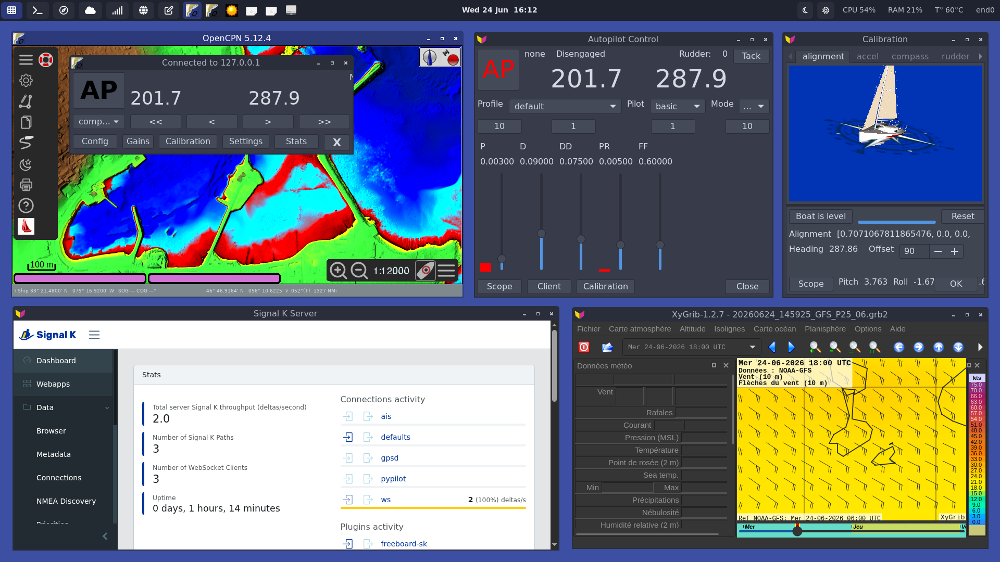

# pypilot-nix

[](https://github.com/darkone-linux/pypilot-nix/actions/workflows/ci.yml)
[](LICENSE)
[](https://nixos.org)
[](.)
[](https://nixos.org)

[English](README.md) | **Français**

**pypilot-nix** est une distribution NixOS déclarative pour la navigation
maritime embarquée sur Raspberry Pi : pilote automatique, hub de données et
traceur de cartes, reproductibles et versionnés.



Toute la pile démarre depuis une seule option NixOS, se construit en une image
SD bootable et se met à jour par SSH comme n'importe quelle machine
NixOS. Cibles : Raspberry Pi 4 (principal) et Pi 5 (expérimental) sur
`aarch64-linux`, avec le **Pypilot HAT** ou le **MacArthur HAT**.

## Fonctionnalités

- **Point d'entrée unique** : `services.navigation.enable = true` câble toute la pile.
- **pypilot** : démon pilote automatique avec fusion IMU RTIMULib et contrôle moteur.
- **Signal K** : hub de données maritimes sur le port 3000, NMEA0183 sur TCP 10110.
- **OpenCPN** : traceur de cartes avec config générée et emplacement pour le plugin pypilot.
- **Horloge GPS hors-ligne** : `gpsd` et `chrony` règlent l'heure sans Internet.
- **HAT matériels** : bus I2C, UART et SPI, modules noyau et overlays device-tree.
- **Périphériques stables** : symlinks udev `/dev/gps0` et `/dev/pypilot_motor` depuis les IDs USB.
- **Découverte de périphériques** : `nav-discover` liste le matériel série et produit du Nix prêt à coller ; un registre `serialDevices` câble udev et Signal K.
- **Secrets chiffrés** : PSK wifi par hôte via sops-nix, déchiffré sur la machine ; `just init <host>` génère la clé et saisit le mot de passe.
- **Images SD par hôte** : une image nommée `pypilot-nix-<host>.img.zst` par machine.
- **Testé en CI** : vérifications d'import des paquets, plus un test d'intégration en VM NixOS.
- **Headless** : SSH, mDNS `.local`, un compte admin `skipper`, aucun écran requis.

## Configuration

`hosts/common.nix` démarre la pile (`services.navigation.enable`) avec les
services headless activés par défaut. Un fichier par hôte ne fixe ensuite que le
nom de la machine et le HAT :

```nix
# hosts/navpi/configuration.nix
{ ... }:
{
  imports = [ ../rpi.nix ];

  networking.hostName = "navpi";

  # HATs installés sur le Pi, activez n'importe quelle combinaison :
  services.navigation.hardware.hats.enablePypilot = true;
  # services.navigation.hardware.hats.enableMacArthur = true;

  # Accéder à Signal K depuis le réseau du bateau :
  services.navigation.signalk.openFirewall = true;

  # Noms /dev stables depuis les IDs `lsusb` :
  # services.navigation.gps.vendorId = "1546";
  # services.navigation.gps.productId = "01a7";
}
```

Hôtes fournis dans le flake :

| Hôte        | Cible                 | HAT / module  | Rôle           |
| ----------- | --------------------- | ------------- | -------------- |
| `navpi`     | Raspberry Pi 4        | Pypilot HAT   | Production     |
| `lab-rpi4`  | Raspberry Pi 4        | Pypilot HAT   | Labo / banc    |
| `lab-rpi5`  | Raspberry Pi 5 ¹      | MacArthur HAT | Labo / banc    |
| `lab-rpi02` | Raspberry Pi Zero 2 W | Camera 3 Wide | Labo / caméra ² |
| `lab-vm`    | VM aarch64            | aucun         | Labo émulé     |

¹ Le support de boot du Pi 5 est expérimental (image aarch64 générique).
² Nœud Wi-Fi headless : diffuse sa caméra CSI en RTSP/WebRTC.

Pour ajouter un bateau ou un banc, déclarer une entrée `nixosConfigurations` de
plus dans `flake.nix`, puis déposer un `hosts/<host>/configuration.nix` ; les
modules sont partagés, aucune logique n'est dupliquée. L'ensemble des options
vit dans `modules/navigation.nix`.

## Réseau : passerelle et hotspot

Le module `network` transforme le boîtier en routeur de réseau local et/ou en
point d'accès WiFi sur un `172.16.0.0/16` figé (le boîtier est `172.16.0.1`),
dnsmasq servant le DHCP et le DNS. Les deux rôles sont inactifs tant qu'on ne les
configure pas :

- **Passerelle** : définir `upstreamInterface` sur le lien Internet. Toutes les
  *autres* interfaces sont pontées dans le réseau local et NATées au travers. Une
  seule passerelle par réseau local.
- **Hotspot** : `hotspot.enable = true` diffuse un AP WPA2 (défauts : SSID
  `<Hostname>OnBoardWifi`, mot de passe `ILikePyPilot`, sur `wlan0`). Avec une
  passerelle il rejoint le même réseau local et le même pool DHCP ; seul, il sert
  le sien.

Fixer des adresses avec `fixedIps` (MAC → IP, dans `172.16.0.2`–`172.16.0.254`) :

```nix
services.navigation.network = {
  upstreamInterface = "eth0";          # rôle passerelle (omettre pour hotspot seul)
  hotspot.enable = true;               # point d'accès WiFi
  fixedIps."de:ad:be:ef:00:11" = "172.16.0.10";
};
```

Changer le SSID et le mot de passe de l'AP avant de prendre la mer — ils sont en
clair dans le store Nix.

## Matériel supporté

Les HAT se posent sur le connecteur 40 broches ; les modules d'extension
utilisent leurs propres connecteurs. Activer n'importe quelle combinaison via
`services.navigation.hardware` — chacun est un booléen, et les conflits de GPIO
entre deux HAT sont détectés par des assertions au build. Le matériel série USB
(GPS, AIS, sondes) n'est **pas** un HAT : le découvrir et le câbler avec
[`nav-discover`](#périphériques-série-et-découverte) (voir plus bas) avant de
toucher à ces interrupteurs.

| Matériel                | Type   | Option d'activation (`services.navigation.`…) | État         |
| ----------------------- | ------ | --------------------------------------------- | ------------ |
| Pypilot HAT             | HAT    | `hardware.hats.enablePypilot`                 | ✅ supporté  |
| MacArthur HAT           | HAT    | `hardware.hats.enableMacArthur`               | 🚧 en test   |
| Camera Module 3 Wide    | module | `hardware.modules.enableCamera3Wide`          | 🚧 en test   |
| HAT Kitronik 5038 AQ    | HAT    | `hardware.hats.enableAqc5038`                 | 🚧 en test   |
| HAT 4G/LTE SIM7600X     | HAT    | `hardware.hats.enableSim7600x`                | 🚧 en test   |
| HAT tactile XPT2046     | HAT    | `hardware.hats.enableXpt2046`                 | 🚧 en test   |

> Seul le Pypilot HAT est validé au banc. Les autres sont implémentés mais encore
> **en test** — ils passeront au ✅ une fois confirmés sur matériel réel.

### Pypilot HAT

Cerveau du pilote automatique : IMU ICM20948 (I2C), LCD + clavier (SPI0) et le
contrôleur moteur sur UART0 (`/dev/ttyOP_pilot`).

```nix
services.navigation.hardware.hats.enablePypilot = true;
```

S'utilise via l'interface web de pypilot (`pypilot_web`, port 8000) pour la
calibration IMU et la barre, ou via le plugin pypilot d'OpenCPN quand le bureau
est actif. Un contrôleur moteur USB s'épingle par une entrée `serialDevices` avec
`role = "pilot"`.

### MacArthur HAT

E/S maritimes multiplexées : CAN MCP2515 pour le **NMEA2000** (SPI0), un récepteur
**AIS** embarqué sur UART0 (`ttyAMA0`), une RTC DS3231 et un double UART SC16IS752
(I2C).

```nix
services.navigation.hardware.hats.enableMacArthur = true;
```

Le NMEA2000 et l'AIS alimentent Signal K automatiquement ; la RTC garde l'heure
hors-ligne. Le brochage suit les conventions du HAT ; encore en test sur matériel.

### Camera Module 3 Wide

Caméra grand-angle IMX708 sur le connecteur CSI — aucun GPIO du header, donc
compatible avec tous les HAT ci-dessus.

```nix
services.navigation.hardware.modules.enableCamera3Wide = true;

# Optionnel : streaming réseau (RTSP + WebRTC) via MediaMTX
services.navigation.hardware.modules.camera3Wide.streaming = {
  enable = true;
  openFirewall = true; # ouvre 8554/tcp (RTSP), 8889/tcp + 8189/udp (WebRTC)
  # width = 1280; height = 720; framerate = 30;
};
```

`cam --list` sur l'hôte confirme le capteur. Streaming activé, se connecter depuis
n'importe quelle machine : WebRTC dans un navigateur sur `http://<host>.local:8889/cam`,
ou RTSP sur `rtsp://<host>.local:8554/cam` (VLC, mpv). L'encodage H.264 matériel
laisse le CPU au repos, et la caméra ne s'allume que pendant qu'un client est
connecté.

### HAT Kitronik 5038 Air Quality Control

Mesure environnementale et E/S : un **BME688** (température, pression, humidité,
indice de qualité de l'air, eCO2) et un **OLED** 128x64 sur I2C, plus un
co-processeur **RP2040** embarqué sur `serial0` pilotant 3 LED ZIP, trois entrées
ADC et une RTC. Les GPIO du header exposent un buzzer, deux sorties 1A et un servo.

```nix
services.navigation.hardware.hats.enableAqc5038 = true;
```

Le module active l'I2C, libère `serial0` pour le RP2040 et installe `i2c-tools`
ainsi qu'un python3 avec `pyserial` + `smbus2` (les protocoles parlés par le HAT).
`i2cdetect -y 1` confirme le BME688 (0x76/0x77) et l'OLED (0x3c). Le pilote
Kitronik n'est pas dans nixpkgs ; l'installer dans un venv avec
`pip install KitronikAirQualityControlHAT`. Détails : [`doc/aqc5038.fr.md`](doc/aqc5038.fr.md).

### HAT 4G/LTE SIM7600X

Liaison cellulaire et **GNSS** : un modem SIMCOM en USB (QMI `wwan0` pour la data,
plus des ports série NMEA/AT). Géré par **ModemManager** à côté du wifi de l'hôte.

```nix
services.navigation.hardware.hats.enableSim7600x = true;
services.navigation.sim7600xHat = {
  apn = "internet"; # vide = auto-détection
  gps.enable = true;
};
```

`mmcli -m any` montre le modem ; le bearer data monte au boot et le port NMEA GPS
est exposé en `/dev/ttySIM_gps`. Le chemin QMI raw-ip/DHCP reste à confirmer au
banc. Détails : [`doc/sim7600x.fr.md`](doc/sim7600x.fr.md).

### HAT tactile XPT2046

Écran TFT SPI (type Waveshare 3.5" **ILI9486**) avec contrôleur tactile résistif
**XPT2046/ADS7846**, tous deux sur SPI0. Partage SPI0 avec les HAT
Pypilot/MacArthur, donc non combinable avec eux.

```nix
services.navigation.hardware.hats.enableXpt2046 = true;
services.navigation.xpt2046Hat.rotate = 90; # 0/90/180/270
```

L'afficheur apparaît en `/dev/fb1` et le tactile en périphérique `/dev/input` ;
calibrer avec `ts_calibrate` ou `xinput_calibrator`. Le bind du panneau et les axes
tactiles restent à confirmer au banc. Détails : [`doc/xpt2046.fr.md`](doc/xpt2046.fr.md).

## Périphériques série et découverte

Le matériel maritime (AIS, GPS, sondes profondeur/vent, contrôleur moteur du
pilote automatique) se connecte via USB ou HAT. pypilot-nix le câble de façon
déclarative via un registre unique, et fournit un CLI de découverte pour le
remplir.

### Le registre `serialDevices`

Une seule option fait foi pour le symlink udev **et** le provider Signal K. Le
nom de l'attribut est le symlink `/dev` :

```nix
services.navigation.serialDevices.ttyOP_ais = {
  match = { vendorId = "27c5"; productId = "0402"; serial = "793379380P51"; };
  role = "ais"; # ais | nmea0183 | pilot
  baudrate = 38400;
};
```

- **`match`** épingle le périphérique :
  - par `vendorId` + `productId` USB (avec `serial` optionnel pour distinguer
    des adaptateurs identiques) ;
  - ou par `port` (un chemin device-tree tel que `fe201000.serial:0.0`) pour un
    UART soudé sans ID USB.
- **`role`** détermine le câblage :

  | role       | symlink udev | service | provider Signal K        |
  | ---------- | ------------ | ------- | ------------------------ |
  | `ais`      | oui          | signalk | NMEA0183 série @ baud    |
  | `nmea0183` | oui          | signalk | NMEA0183 série @ baud    |
  | `pilot`    | oui          | pypilot | aucun (géré par pypilot) |

> [!NOTE]
> Le **GPS** garde son option dédiée, `services.navigation.gps` (gpsd possède le
> récepteur et discipline l'horloge). Le NMEA2000/CAN est géré par le module du
> HAT MacArthur, pas par ce registre. Les options historiques `ais`/`motor`
> fonctionnent toujours : elles sont traduites en interne vers des entrées du
> registre.

### Découvrir les périphériques avec `nav-discover`

`nav-discover` est un CLI en lecture seule (installé sur chaque hôte) qui énumère
les ports série et imprime, pour chacun, un extrait Nix prêt à coller :

```shell
nav-discover         # liste les périphériques, devine le rôle par l'ID USB
nav-discover --sniff # ouvre chaque port, lit le NMEA0183 et détecte le rôle
```

Boucle de travail :

1. Brancher le matériel.
2. Lancer `nav-discover [--sniff]`.
3. Coller l'extrait dans `hosts/<host>/configuration.nix`.
4. Lancer `nixos-rebuild switch`.

Un GPS détecté produit un extrait `services.navigation.gps` ; l'AIS et les
sondes produisent des entrées `serialDevices`.

> [!TIP]
> `--sniff` n'ouvre pas un port déjà tenu par gpsd ou Signal K : lancer le scan
> avant d'assigner le périphérique, ou arrêter d'abord le service qui le
> consomme. Sur un hôte avec le bureau labwc, le même scan est accessible depuis
> le menu clic-droit, **Outils → Scan Matériel**.

## Secrets et wifi (sops)

Les secrets par hôte — aujourd'hui le PSK wifi d'un nœud headless comme
`lab-rpi02` — sont chiffrés avec [sops-nix](https://github.com/Mic92/sops-nix).
Le clair n'entre jamais dans git ni dans le store Nix : `secrets/<host>.yaml` est
commité **chiffré** et déchiffré sur la machine à l'activation, dans
`/run/secrets`.

`just init <host>` provisionne un hôte en une étape idempotente :

```shell
nix develop          # met just + sops + age + yq dans le PATH
just init lab-rpi02  # génère la clé, l'enregistre, saisit le mot de passe wifi
```

La recette génère la clé age de l'hôte dans `secrets/keys/<host>.txt`
(**jamais commitée**), enregistre sa clé publique dans `.sops.yaml`, et — si
l'hôte active le wifi — demande une fois le mot de passe puis écrit
`secrets/<host>.yaml` chiffré. Relancer conserve une clé/un secret existants.
Commiter ensuite `secrets/<host>.yaml` et `.sops.yaml` ; le SSID (non secret)
reste dans `hosts/<host>/configuration.nix`.

Avant le premier boot d'une machine headless, copier sa clé **privée** sur la
partition de boot de la SD, là où l'hôte la lit (`sops.age.keyFile`) :

```shell
cp secrets/keys/lab-rpi02.txt /run/media/$USER/FIRMWARE/secrets/age.txt
# chemin sur le Pi : /boot/firmware/secrets/age.txt
```

Sans cette clé, la machine ne peut pas déchiffrer le PSK, ne rejoint jamais le
wifi et — étant headless — reste injoignable ; le build émet un warning quand le
secret manque.

> [!WARNING]
> Quiconque a la carte physique peut lire cette clé et le secret chiffré qu'elle
> contient : sans TPM, possession physique = accès. sops protège le dépôt, la CI
> et le cache binaire — pas une carte volée. Changer le PSK si une carte est
> perdue.

Workflow complet et rotation : [`secrets/README.md`](secrets/README.md).

## Construire l'image SD

Les images SD sont en `aarch64` : construire sur une machine ARM native, un
builder distant, ou un hôte x86_64 avec l'émulation `binfmt`. Le cache
`nix-community` évite de recompiler le gros du système.

```shell
just sd-image navpi
# ou : nix build .#packages.aarch64-linux.navpi-sdImage -o result-navpi
```

Le résultat est une image compressée :

```
result-navpi/sd-image/pypilot-nix-navpi.img.zst
```

Hôtes avec image SD : `navpi`, `lab-rpi4`, `lab-rpi5`. Le `lab-vm` tourne en VM
(voir plus bas).

## Installation

### 1. Flasher la carte SD

L'image est compressée en zstd : décompresser et écrire en un seul pipe.

```shell
zstd -dc result-navpi/sd-image/*.img.zst \
  | sudo dd of=/dev/sdX bs=4M status=progress conv=fsync
```

> [!WARNING]
> Revérifier la cible avant d'écrire : le mauvais périphérique efface un disque.

### 2. Premier démarrage

L'image embarque SSH et mDNS activés, joignable à `<host>.local` :

- utilisateur `skipper`, mot de passe `NixPypilot` (défaut d'amorçage, à changer) ;
- pour des déploiements sans mot de passe, ajouter votre clé à
  `users.users.skipper.openssh.authorizedKeys.keys` puis reconstruire.

### 3. Itérer par SSH

Plus de reflashage ensuite : construire en local et pousser la closure.

```shell
nixos-rebuild switch \
  --flake .#navpi \
  --target-host skipper@navpi.local --use-remote-sudo \
  --build-host localhost
```

> [!TIP]
> Pour un rollback automatique en cas d'échec, ajouter l'input `deploy-rs` et
> utiliser `deploy .#<host>` (pas encore câblé ici).

### VM de labo (sans matériel)

Lancer la VM de labo aarch64 persistante (sur un hôte aarch64, ou x86_64 avec
émulation système complète binfmt), puis la mettre à jour comme un vrai Pi :

```shell
nix run .#lab-vm
nixos-rebuild switch --flake .#lab-vm --target-host skipper@lab-vm.local --use-remote-sudo
```

## Commandes Just

Le `Justfile` regroupe les commandes du quotidien. Lancer `just` (ou
`just --list`) pour toutes les voir.

| Recette                   | Rôle                                                     |
| ------------------------- | -------------------------------------------------------- |
| `just clean`              | `fix` + `check` + `format` (avant chaque commit)         |
| `just init <host>`        | Génère la clé sops d'un hôte et saisit son PSK wifi      |
| `just sd-image <host>`    | Construit l'image SD d'un hôte                           |
| `just apply <host> [act]` | Déploie un hôte par SSH (`act` vaut `switch` par défaut) |
| `just update`             | Met à jour les inputs, commit `flake.lock` s'il change   |
| `just gc <host>`          | Libère de l'espace sur un hôte puis régénère son boot    |

```shell
just apply lab-rpi4          # nixos-rebuild switch sur lab-rpi4
just apply lab-rpi4 boot     # prépare pour le prochain boot au lieu de switcher
just update                  # bump des inputs, commit auto du lockfile
just gc lab-rpi4             # nix-collect-garbage -d par SSH, rafraîchit le boot
```

> [!NOTE]
> Les recettes de déploiement ciblent `skipper@<host>` par SSH et utilisent le
> `sudo` de l'hôte : la clé `skipper` doit être autorisée et le compte sudoer.

## Documentation

Voir [`doc/pypilot-nix-specs.md`](doc/pypilot-nix-specs.md) pour la conception
complète, la plomberie du flux de données et la stratégie de test.
